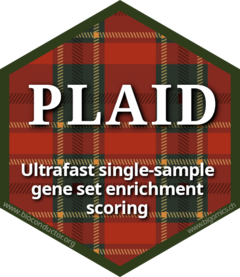

# PLAID: ultrafast single-sample gene set enrichment  

[](https://codecov.io/github/bigomics/plaid)

PLAID (Pathway Level Average Intensity Detection) is an ultrafast
method to compute single-sample enrichment scores for gene expression
or proteomics data. For each sample, PLAID computes the gene set score
as the average intensity of the genes/proteins in the gene set. The
output is a gene set score matrix suitable for further analyses.

A distinctive feature of PLAID is that it can simulate few of the most
widely used single-sample gene set scoring algorithms (GSVA, ssGSEA, scSE, ucell, sing),
enabling researchers to replace those functions and gain much improved
runtime efficiency and memory requirement. Typically, PLAID can be more than 
100 times faster and requiring 10 times less memory than the original algorithm.

#### Key features

- Ultra-fast single-sample gene set enrichment scoring
- Includes multiple scoring methods (plaid, sing, ssgsea, scSE, ucell, gsva)
- Works with regular matrices, sparse matrices, and Bioconductor data structures
- Automatically detects and handles Bioconductor objects (`SummarizedExperiment`, `SingleCellExperiment`, `BiocSet`)
- Built-in differential enrichment testing

#### Warning

PLAID is fast. Ludicrously fast. Please fasten seatbelts and do not drink before usage.

## Installation

You can install plaid from Bioconductor:

```r
if (!require("BiocManager", quietly = TRUE))
    install.packages("BiocManager")

BiocManager::install("plaid")
```

You can also install the development version from GitHub:

```r
if (!require("remotes", quietly = TRUE))
    install.packages("remotes")

remotes::install_github("bigomics/plaid")
```

## Usage

For detailed usage examples and tutorials, please see our vignettes:

- [Getting Started with PLAID](vignettes/plaid-vignette.Rmd)
- [Comparing Methods](vignettes/compare-vignette.Rmd)

PLAID is the main single-sample gene set scoring algorithm in OmicsPlayground, our 
Bioinformatics platform at BigOmics Analytics. In OmicsPlayground, you 
can perform PLAID without coding needs.

## References

For more technical details please refer to our papers. Please cite us when you use
PLAID as part of your research. 

- Zito A., et al. PLAID: ultrafast single-sample gene set enrichment scoring. [BioRxiv preprint](https://www.biorxiv.org/content/10.1101/2025.06.14.659661v1). June 2025.
- Akhmedov M., et al., Omics Playground: a comprehensive self-service platform for visualization, analytics and exploration of Big Omics Data, NAR Genomics and Bioinformatics, Volume 2, Issue 1, March 2020, [lqz019](https://doi.org/10.1093/nargab/lqz019).

## Support

For support feel free to reach our Bioinformatics Data Science Team at
BigOmics Analytics: help@bigomics.ch

If you like PLAID, please recommend us to your friends, buy us [coffee](https://buymeacoffee.com/bigomics)
or brag about PLAID on your social media. 
